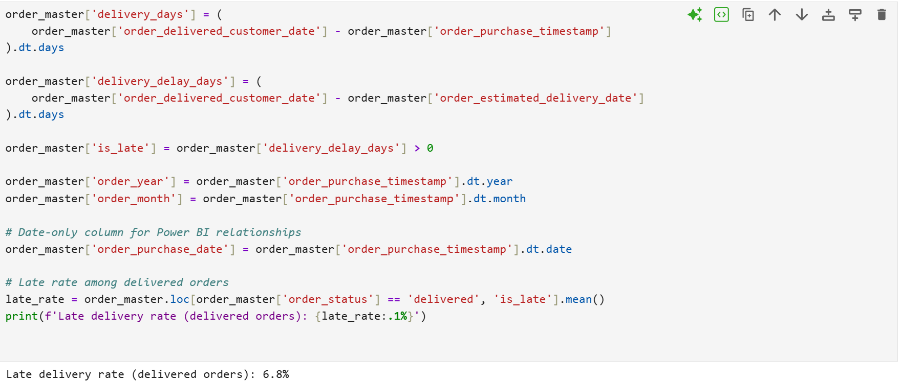
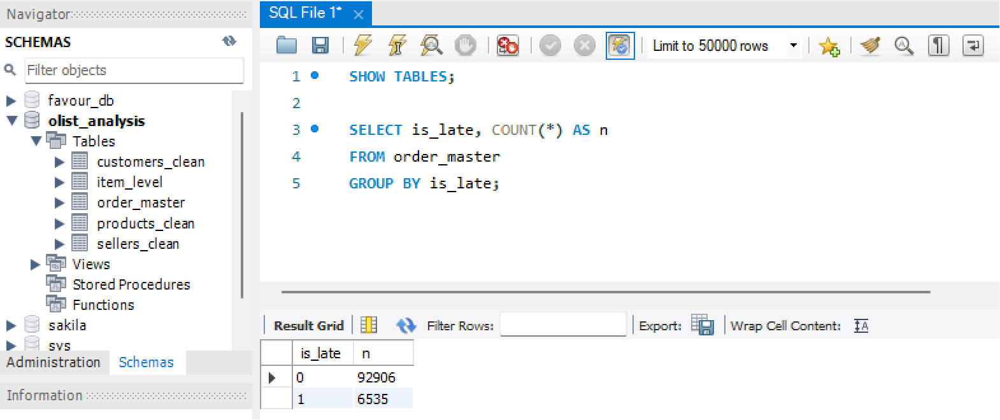

# Olist E-Commerce Analytics

End-to-end analysis of **99,441** Brazilian marketplace orders (2016–2018, BRL).  
**Python (pandas) · MySQL · Power BI**

<a href="https://favour-onyenike.github.io/PORTFOLIO/">
  
</a>
&nbsp;
<a href="https://www.linkedin.com/in/favour-onyenike">
  
</a>
&nbsp;
<a href="mailto:onyenikefavour8@gmail.com">
  
</a>

---

## Why this project

Olist connects small sellers to customers and does not hold stock. Strong sales can hide weak delivery and low repeat purchase.

**My goal:** clean nine related tables, store them in MySQL, build a three-page Power BI dashboard, and recommend actions tied to the numbers.

**Questions answered**
1. How did revenue move over time and by category / payment type?  
2. How often are deliveries late, and does that change by state?  
3. Do longer waits link to worse review scores?  
4. How concentrated is revenue among sellers?

---

## What I built

**1. Python (pandas)**  
Fixed order dates; engineered `delivery_days`, `delivery_delay_days`, and `is_late` (0/1); merged Portuguese product categories to English; aggregated payments and items at the right grain so revenue is not double-counted.

**2. MySQL**  
Created typed tables with primary keys, imported the cleaned CSVs, and validated row counts and the `is_late` distribution before reporting.

**3. Power BI**  
Built relationships and a date column, wrote DAX KPIs, and designed three pages — Overview, Delivery, Sellers — with slicers and page navigation.

**Data:** [Olist on Kaggle](https://www.kaggle.com/datasets/olistbr/brazilian-ecommerce) · 9 CSVs · 27 states · ~71 English categories after translation  
**Note:** `customer_unique_id` = the person; `customer_id` is assigned per order — retention uses unique id.

---

## Results

- **Total revenue:** ~R$13.6M  
- **Late delivery rate:** ~6.8%  
- **Repeat customer rate:** ~3.1%  
- **Average wait at review score 1 vs 5:** ~17 days vs ~10 days  
- **Top seller vs average seller revenue:** ~R$459K vs ~R$8.8K  
- **Top 10 sellers’ share of revenue:** ~13%  

**Insight:** Revenue grew, but late delivery tracks with worse scores, almost nobody buys twice, and a small set of sellers drives a large share of revenue.

---

## How the metrics were calculated (DAX)

These measures sit on the cleaned `order_master` model in Power BI.

**Total revenue** — sum of order value:

```dax
Total Revenue = SUM('order_master'[order_value])
```

**Total orders** — unique order count:

```dax
Total Orders = DISTINCTCOUNT('order_master'[order_id])
```

**Late delivery rate** — late orders as a share of delivered orders (`is_late` was created in Python as 0/1):

```dax
Late Delivery Rate =
DIVIDE(
    CALCULATE(COUNTROWS('order_master'), 'order_master'[is_late] = 1),
    CALCULATE(COUNTROWS('order_master'), 'order_master'[order_status] = "delivered"),
    0
)
```

**Repeat customer rate** — customers with more than one order, using `customer_unique_id`:

```dax
Total Customers =
DISTINCTCOUNT('order_master'[customer_unique_id])

Repeat Customers =
CALCULATE(
    DISTINCTCOUNT('order_master'[customer_unique_id]),
    FILTER(
        VALUES('order_master'[customer_unique_id]),
        CALCULATE(DISTINCTCOUNT('order_master'[order_id])) > 1
    )
)

Repeat Customer Rate =
DIVIDE([Repeat Customers], [Total Customers], 0)
```

**Average delivery delay (for the review-score chart)** — used as a value on a column chart with `review_score` on the axis:

```dax
Avg Delivery Delay Days =
AVERAGE('order_master'[delivery_delay_days])
```

*(In Python, `delivery_delay_days` = delivered date minus estimated delivery date; positive means late.)*

---

## Recommendations

1. Track late rate, reviews, and revenue by state and seller in one scorecard.  
2. Flag orders at risk of being late before the estimated delivery date.  
3. Compare fulfilment practices of top sellers vs the long tail.  
4. Pilot retention offers for one-time buyers (especially 4–5 star reviews).

---

## Dashboard

**Overview** — KPIs, revenue trend, payment mix  


**Delivery** — late rate by state and delay patterns  


**Main insight** — longer delays line up with worse review scores (1 = worst, 5 = best)  


**Sellers** — concentration and top performers  


**Data model** — tables and relationships in Power BI  


---

## Cleaning and database

**Python cleaning** — category translation, delivery flags, and export checks  



**MySQL** — cleaned tables loaded and validated  



---

## Reproduce

1. Download Kaggle CSVs → `data/raw/`  
2. Run cleaning notebook → export to `data/processed/`  
3. Load into MySQL  
4. Connect Power BI and recreate measures / three pages  

---

## Skills demonstrated

1. Multi-table data cleaning  
2. Feature engineering  
3. SQL schema design and validation  
4. DAX KPI measures  
5. Interactive dashboard design  
6. Evidence-based business recommendations  

---

## Contact

<a href="https://www.linkedin.com/in/favour-onyenike">
  
</a>
&nbsp;
<a href="https://favour-onyenike.github.io/PORTFOLIO/">
  
</a>
&nbsp;
<a href="mailto:onyenikefavour8@gmail.com">
  
</a>
&nbsp;
<a href="https://www.instagram.com/favour.ogo_/">
  
</a>
