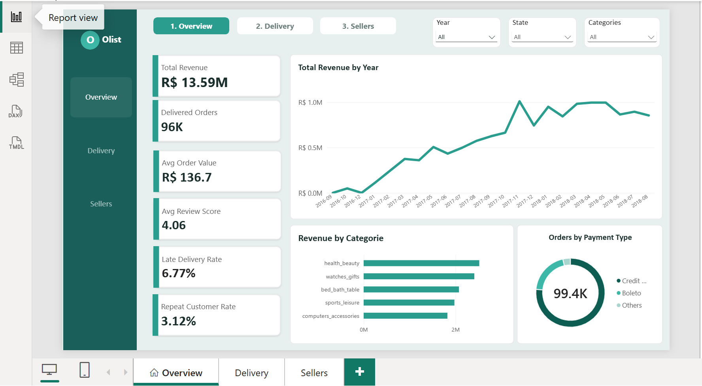
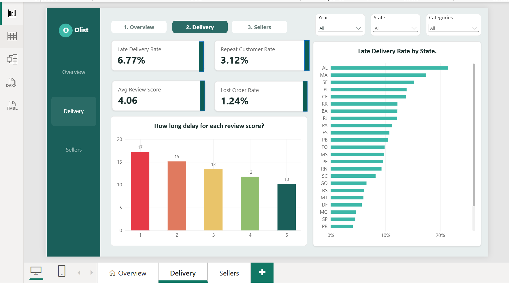
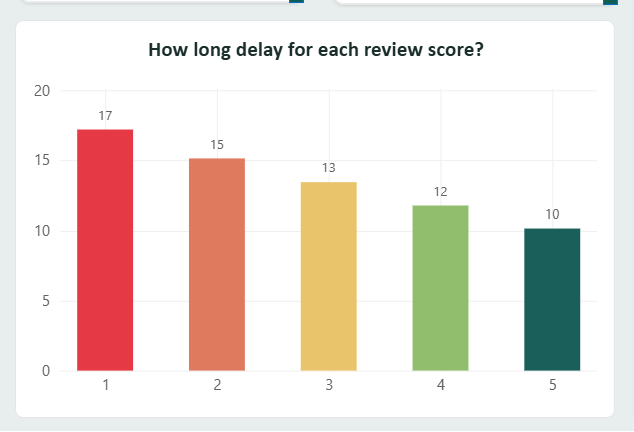
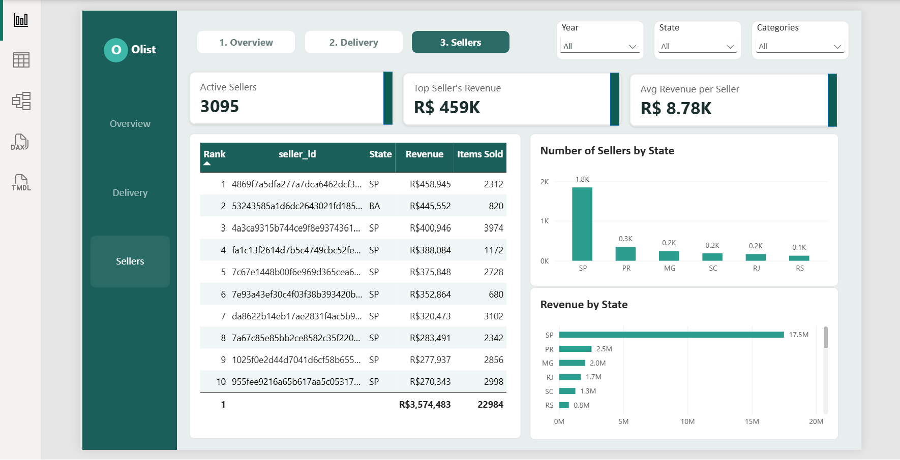
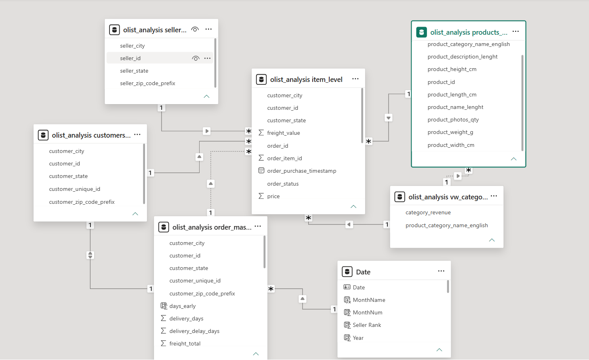

# Olist E-Commerce Analytics

End-to-end analysis of **99,441** Brazilian marketplace orders (2016–2018, BRL).  
**Python (pandas) · MySQL · Power BI**

[Live portfolio](https://favour-onyenike.github.io/PORTFOLIO/) · [LinkedIn](https://www.linkedin.com/in/favour-onyenike) · [Email](mailto:onyenikefavour8@gmail.com)

---

## Why this project

Olist connects small sellers to customers and does not hold stock. Strong sales can hide weak delivery and low repeat purchase.  

**My goal:** clean nine related tables, store them in MySQL, build a three-page Power BI dashboard, and recommend actions tied to the numbers.

**Questions answered**
1. How did revenue move over time and by category / payment type?  
2. How often are deliveries late, and does that change by state?  
3. Do longer waits link to worse review scores?  
4. How concentrated is revenue among sellers?

---

## What I built

| Step | Tool | Specific work |
|------|------|----------------|
| 1. Clean | **Python** | Fixed dates; engineered `delivery_days`, `delivery_delay_days`, `is_late` (0/1); merged Portuguese→English categories; aggregated payments/items so revenue is not double-counted |
| 2. Store | **MySQL** | Typed tables, primary keys, import validation (row counts, `is_late` distribution) |
| 3. Report | **Power BI** | Relationships + date column; DAX KPIs; pages: **Overview**, **Delivery**, **Sellers**; slicers and page navigation |

**Data:** [Olist on Kaggle](https://www.kaggle.com/datasets/olistbr/brazilian-ecommerce) · 9 CSVs · 27 states · ~71 English categories after translation  
**Note:** `customer_unique_id` = person; `customer_id` is per order — retention uses unique id.

---

## Results

| Metric | Value |
|--------|------:|
| Total revenue | ~R$13.6M |
| Late delivery rate | ~6.8% |
| Repeat customer rate | ~3.1% |
| Avg wait (review 1 vs 5) | ~17 days vs ~10 days |
| Top seller vs average seller | ~R$459K vs ~R$8.8K |
| Top 10 sellers’ share of revenue | ~13% |

**Insight:** Revenue grew, but late delivery tracks with worse scores, almost nobody buys twice, and a small set of sellers drives a large share of revenue.

---

## Recommendations

1. Track **late rate + reviews + revenue** by state and seller in one scorecard.  
2. Flag orders at risk of being late *before* the estimated delivery date.  
3. Compare fulfilment practices of top sellers vs the long tail.  
4. Pilot retention offers for one-time buyers (especially 4–5 star reviews).

---

## Dashboard screenshots

> Upload these files into the `dashboard/` folder (exact names). Images appear here once uploaded.

**Overview** — KPI row + revenue trend + payment mix  


**Delivery** — full Delivery page  


**Delay by review score** — red→green column chart (main insight)  


**Sellers** — top sellers / concentration  


**Model** — Power BI relationships view  


---

## Sample DAX

```dax
Total Revenue = SUM('order_master'[order_value])

Late Delivery Rate =
DIVIDE(
    CALCULATE(COUNTROWS('order_master'), 'order_master'[is_late] = 1),
    CALCULATE(COUNTROWS('order_master'), 'order_master'[order_status] = "delivered"),
    0
)
```

---

## Reproduce

1. Download Kaggle CSVs → `data/raw/`  
2. Run cleaning notebook → export to `data/processed/`  
3. Load into MySQL  
4. Connect Power BI and recreate measures / three pages  

---

## Skills demonstrated

Multi-table cleaning · Feature engineering · SQL schema & validation · DAX KPIs · Dashboard design · Evidence-based recommendations

---

**Favour Onyenike** · First-class B.Sc. Computer Science, Baze University  
[Website](https://favour-onyenike.github.io/PORTFOLIO/) · [GitHub](https://github.com/Favour-Onyenike) · [LinkedIn](https://www.linkedin.com/in/favour-onyenike)
